# Readme Generator
[](https://opensource.org/licenses/MIT)

## Description
CLI program to create a readme.md file for a project

## Table of Contents

1. [Installation](#1-installation)
2. [Usage](#2-usage)
3. [License](#3-license)
4. [Contributing](#4-contributing)
5. [Questions](#5-questions)

## 1 Installation
1. Download repository [Readme Generator](https://github.com/Zarlengo/readme-generator)
    ```
    Git clone https://github.com/Zarlengo/readme-generator
    ```
2. Install dependencies
    ```
    npm install
    ```

## 2 Usage
1. Run the index.js file
    ```
    node index.js
    ```
    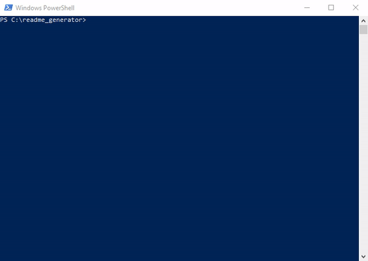
2. Enter the repository location URL
    ```
    What is the URL of your repository?
    ```
    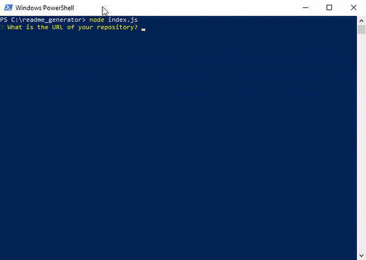
3. Enter the save folder location for the md file
    ```
    What is the folder path where you want to save the readme.md file?
    ```
    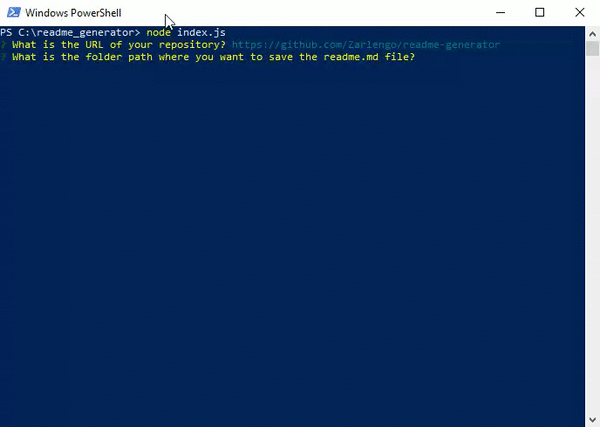
4. Enter the project name
    ```
    What is the name of your project?
    ```
    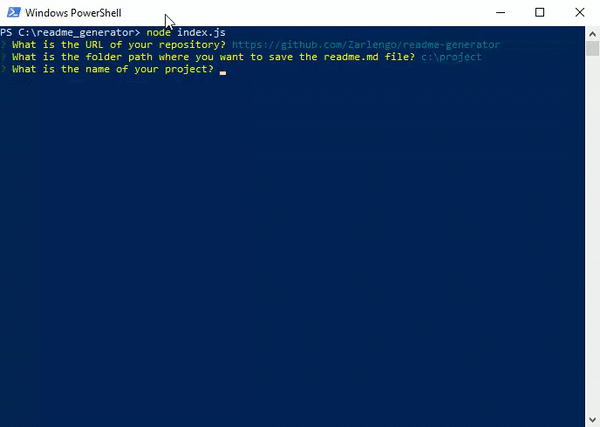
5. Enter the project description
    ```
    What is the description for your project?
    ```
    
6. Enter the installation steps (this will open in a text editor, formatting in markdown)
    ```
    What are the steps required to install your project?
    ```
    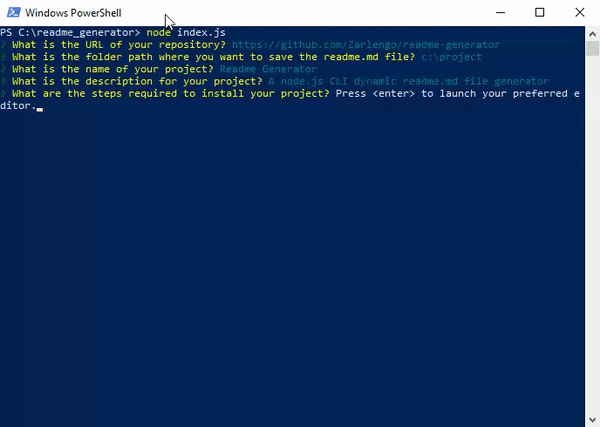
    
7. Enter instruction on how to use your program
    ```
    What are the usage instructions for your project?
    ```
    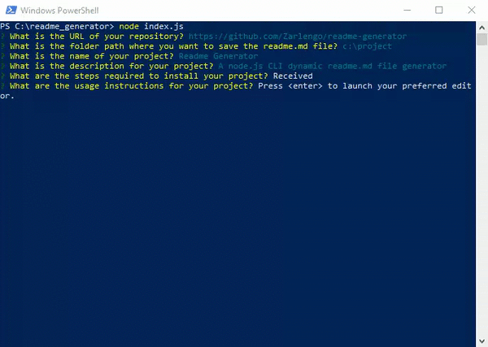
    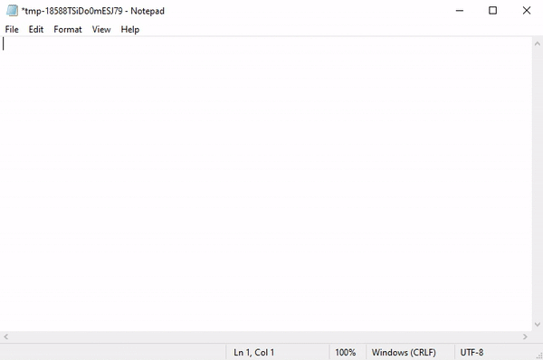
8. Pick software license
    ```
    Choose your license
    ```
    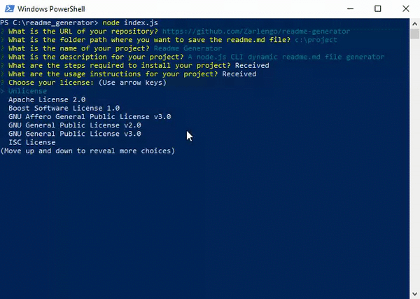
9. Enter all contributor github usernames, each person on a new line
    ```
    What are the github usernames for the contributors?
    ```
    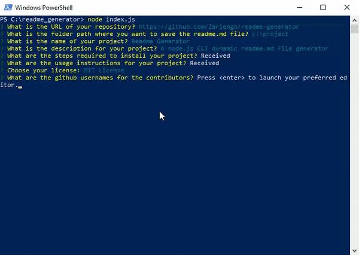
    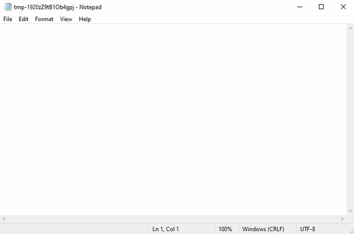
10. Enter test procedures
    ```
    What are the test steps for your project?
    ```
    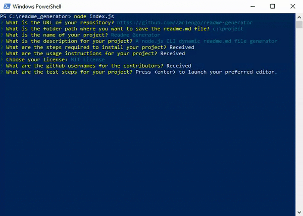
    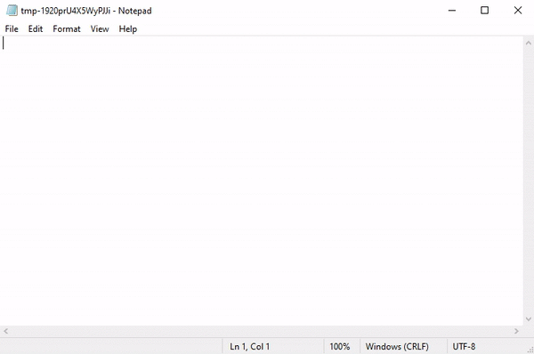
11. Enter the authors name
    ```
    What is your name?
    ```
    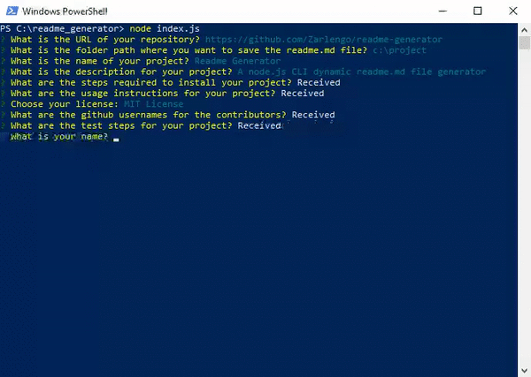
12. Enter the authors github username
    ```
    What is your github username?
    ```
    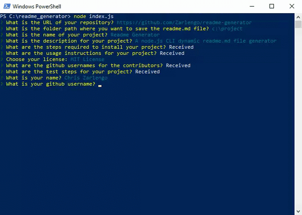
13. Enter the author's email
    ```
    What is your email?
    ```
    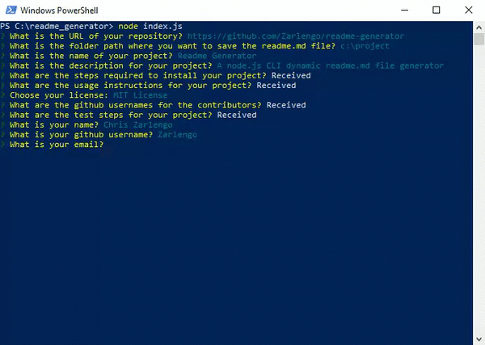
14. Success message (or failure message) will display upon completion
    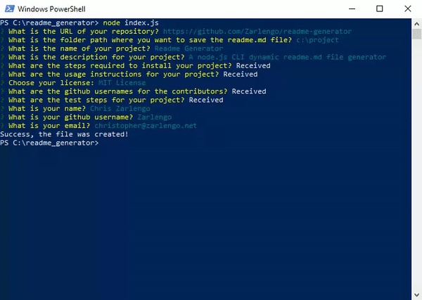
## 3 License
    Copyright © 2020 Chris Zarlengo

    Permission is hereby granted, free of charge, to any person obtaining a copy
    of this software and associated documentation files (the "Software"), to 
    deal in the Software without restriction, including without limitation the 
    rights to use, copy, modify, merge, publish, distribute, sublicense, and/or
    sell copies of the Software, and to permit persons to whom the Software is
    furnished to do so, subject to the following conditions:

    The above copyright notice and this permission notice shall be included in
    all copies or substantial portions of the Software.

    THE SOFTWARE IS PROVIDED "AS IS", WITHOUT WARRANTY OF ANY KIND, EXPRESS OR
    IMPLIED, INCLUDING BUT NOT LIMITED TO THE WARRANTIES OF MERCHANTABILITY,
    FITNESS FOR A PARTICULAR PURPOSE AND NONINFRINGEMENT. IN NO EVENT SHALL THE
    AUTHORS OR COPYRIGHT HOLDERS BE LIABLE FOR ANY CLAIM, DAMAGES OR OTHER
    LIABILITY, WHETHER IN AN ACTION OF CONTRACT, TORT OR OTHERWISE, ARISING
    FROM, OUT OF OR IN CONNECTION WITH THE SOFTWARE OR THE USE OR OTHER DEALINGS
    IN THE SOFTWARE.

## 4 Contributing
* [Zarlengo](https://github.com/Zarlengo)

## 5 Questions
* [Github Profile for Zarlengo](https://github.com/Zarlengo)
* [Send email to christopher@zarlengo.net](mailto:christopher@zarlengo.net)
* [File an issue](https://github.com/Zarlengo/readme-generator/issues)
